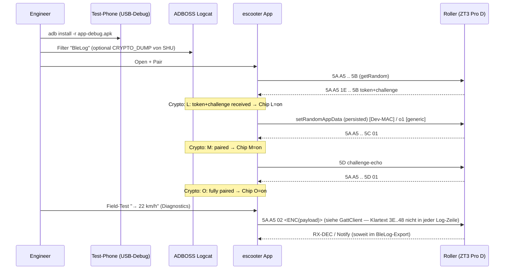

# Validation-Playbook (escooter / ZT3 Pro D)

Dokument für Feld- und Bench-Validierung der App gegen Roller, Logcat und (optional) SHU/patched SHU. Kein Ersatz für rechtssichere Straßennutzung; nur technische Vorgehensweise.

## 0. Pre-Test-Checkliste

- Akku des Rollers deutlich über 50 % (stabile Verbindung während längerer Sitzungen)
- **USB-Debugging** auf dem Test-Phone aktiviert, ggf. ADB-Authentifizierung (RSA-Fingerprint) bestätigt
- **Bluetooth** und, falls vom OEM gefordert, **Standort** bzw. „Nearby devices“ erlaubt
- Zuletzt genutzte **offizielle Ninebot-/Segway-App** getrennt oder beendet, damit kein GATT-Connect-Race entsteht
- Phone in durchgehender Reichweite, vorheriger **escooter**-Lauf in den Multitasking-Recents wirklich beendet (kein hängender GATT-Client)

## 1. ADBOSS starten

Siehe [ADBOSS-SETUP.md](ADBOSS-SETUP.md) – Workspace-Sibling: relativ von `escooter/reverse-engineering/` der Pfad `../../adboss` (Venv: `source venv/bin/activate`, Start `python3 main.py`).

Dort: Logcat-Tab, Device auswählen, Filter-Strings so setzen, dass **v. a. Tag `BleLog`** (siehe §2.1) und optional gepatchte-SHU-Tag **`CRYPTO_DUMP`** sichtbar sind — das Wort „Crypto“ in unseren Tabellen meint **Inhaltszeilen** in `BleLog`, keinen zweiten Prozess-Log-Tag.

## 2. App-Logcat-Recipes

### 2.1 Android-Logcat-Tag **vs.** Inhalts-„Tags“ (wichtig)

- **Ein** Android-Logcat-**Tag** pro escooter-BleLog-Zeile: `BleLog` (Timber, siehe [BleLog.kt](../app/app/src/main/kotlin/com/celox/segway/core/util/BleLog.kt)). Alles, was `grep Crypto` o. ä. trifft, steht in der **Textzeile** hinter `D/BleLog:`, z. B. `-- Crypto …`, `-- Cmd …`, `TX RX-WRITE …`.
- Die Wörter **`Crypto`**, **`Cmd`**, **`RX-DEC`**, **`SCAN`**, **`Reconnect`** in Doku-Tabellen sind **Note-Kategorien** bzw. Zeilenpräfixe in **diesem** Tag — **keine** separaten `adb logcat -s Crypto`-Prozess-Tags (außer eine andere App loggt wirklich mit Tag `CRYPTO_DUMP` / `SCAN`).
- **Beweis-Typen (getrennt halten):**
  1. **Live `adb` / ADBOSS:** sinnvoll prüfen auf `-- Cmd` (z. B. `SetSpeedLimit`), **TX**-Zeilen mit **tatsächlich gesendeten** Oktetten: bei NinebotCrypto typischerweise **verschlüsselter** Körper `5A A5 02 …` (siehe [GattClient](../app/app/src/main/kotlin/com/celox/segway/core/ble/GattClient.kt) → `bleLog.tx("RX-WRITE", frame)` = **Wire-Bytes**).
  2. **Innere Klartext-Register-Bytes** (z. B. `3E 16 02 48` + km/h) erscheinen in **Live-BleLog-TX** in der Regel **nicht** im Klartext; sie entweder: **patchte SHU** `CRYPTO_DUMP`, **Pcap/btsnoop**-Decode, **SHU-Referenz**, oder Protokolldokumentation / `encodeCrypto`‑Kontext — **nicht** zwingend als vollständige Kette in einer Zeile `adb logcat -d`.

Vorgefertigte Befehle (Device per USB/ADB). Primär reicht **ein** Sichtbar-Tag `BleLog`:

```text
# Alles der App, das BleLog emittiert (inkl. Crypto/Cmd-Noten in derselben Zeile)
adb logcat *:S BleLog:V

# Oder klassisch Zeitstempel
adb logcat -v time *:S BleLog:V
```

**Patchte SHU**-Referenz parallel (nur wenn installiert; dann existiert oft ein **eigener** Tag pro SHU-Build, z. B. `CRYPTO_DUMP` — Hersteller-App prüfen):

```text
adb logcat *:S BleLog:V CRYPTO_DUMP:V
```

**Scan-/Register-Sweeps:** in BleLog-Notizen mit `tag=SCAN` bzw. RX-Dekodierung; filtern in der Shell z. B. `adb logcat *:S BleLog:V | grep -E 'SCAN|RX-DEC'`.

Auf ADBOSS: **einen** Filter `BleLog` fürs Hauptgerät; ggf. zweite Quelle `CRYPTO_DUMP` wenn SHU. `-v time` beibehalten.

## 3. Patched-SHU CRYPTO_DUMP

Für Hintergrund und exakte **Smali**-/Build-Hinweise der gepatchten ScooterHacking-Utility-APK siehe in [app/README.md – „Patched-SHU als Referenz-Tool“](../app/README.md#patched-shu-als-referenz-tool): Tag `CRYPTO_DUMP`, **Patch in `c6/c.smali`** an der Methode `i([B)[B` (Log direkt nach der `kotlin.jvm.internal.m.e()`-Validation).

Typische **Log-Zeile** (Base64- und Key-Felder, grob): `D=<ciphertext+tag base64> T=<token> R=<random> K=<aesKey> C=<counter>` (Details siehe README).

## 4. btsnoop-Pull-Workflow

- **Aktivieren:** Entwickleroptionen → *Bluetooth HCI snoop log* (oder vergleichbar, je nach OEM-Bezeichnung).
- **Pull (je nach Hersteller/Android-Version, der Pfad weicht ab):**
  1. Primär: `adb pull /sdcard/Android/data/com.android.bluetooth/files/btsnoop_hci.log`
  2. Fallback: `adb pull /sdcard/btsnoop_hci.log`
  3. Mit Root/Recovery-Workflow: `/data/misc/bluetooth/logs/btsnoop_hci.log` (Berechtigungen beachten)
- Wenn alles hakt: `adb bugreport` als Sammel-**Notnagel** (Lage, Permissions, ggf. eingebettete Logs; große ZIPs).
- **Analyse:** Datei in **Wireshark** öffnen (Filter auf ATT, Connection-Handles, etc.).

## 5. Capture-Ablage-Konvention

Neue BLE/RE-Captures (Markdown) unter `escooter/reverse-engineering/ble-captures/`, Namenschema: `<yyyy-mm-dd>-<thema>.md` – inhaltlich analog [2026-04-25-shu-flash-session.md](ble-captures/2026-04-25-shu-flash-session.md) mit Header, **Timeline**, **Frame-Tabelle** (wenn sinnvoll) und **Conclusion**.

## 6. Erfolgs-Sanity-Check: „SHU-Pfad lebt“ (22 km/h)

1. **App installieren:** `cd app && ./gradlew :app:installDebug` (mit gültigem `local.properties` / `sdk.dir`).
2. **Roller paaren** (Pair-Flow, gleiches Gerät wie bisher in Tests).
3. **Diagnostics** öffnen: **L / M / O**-Chips sollen den Fortschritt klar zeigen.
   - First-pair: typischerweise **L → M → O**.
   - Resume (persisted-random Dev-Pfad): **M** kann bereits nach Random-Resume sichtbar sein, bevor die nächste Ack-Runde bei **O** ankommt; Ziel bleibt ein nachvollziehbarer Fortschritt statt L→(M+O)-Sprung.
4. **Field-Test** „→ 22 km/h“ tippen (ausschließlich aus **DiagnosticsScreen** / Field-Test-Buttons, keine Stealth-Vol-Abfolge, wenn die Abnahme „nur Playbook-UI“ verlangt).
5. In **Logcat/Export (Tag `BleLog`!)** prüfen:
   - **Handshake:** Notizen `Crypto` mit L/M/O gemäß App, bis sinnvoll **„O: fully paired“** bzw. gleichwertiger Stand (Build-abhängig).
   - **SetSpeed:** Zeile `-- Cmd` mit `SetSpeedLimit(22)` bzw. gleichwertig; dazu **direkt folgende** `TX RX-WRITE` mit **Wire-Präfix** `5A A5 02` und **verschlüsselter** Restnutzlast (kein vollständiger Klartext `3E 16 02 48 14 16` in **dieser** Zeile anfordern).
   - **Kläre Klartext** (`3E 16 02 48` …) bei Bedarf: **§3 CRYPTO_dump**, **Pcap/btsnoop**, `zt3-ble-register-reference` oder Codepfad `encodeCrypto` **— nicht** false negative, wenn Wire nur `5A A5 02 …` zeigt.
   - **RX:** wo ausgegeben, `RX-DEC` bzw. `cmd=05`-Echo (buildabhängig).

**Typische Sequenz (Mermaid, **logisch/illustrativ** — Wire-Bytes sind im Crypto-Pfad **verschlüsselt**, Diagramm = Innenleben-Konzept, nicht 1:1 roher Live-TX-String):**



(Abkürzungen: Dev-MAC mit hardcodiertem `persistedRandom` aus App; andernfalls OOB-First-Pair-Story aus Projekt-README beachten.)

## Referenzen (kurz)

- [ADBOSS-SETUP.md](ADBOSS-SETUP.md)
- [app/README.md](../app/README.md) – Build, Patched-SHU, Debug-Hinweise
- [ble-captures/2026-04-25-shu-flash-session.md](ble-captures/2026-04-25-shu-flash-session.md) – Musterdokument für Captures

> Hinweis: generischer Random-Import/Resume-Workflow ist bewusst **nicht** Teil dieses Phase-1-Playbooks und wird in einer spaeteren Phase dokumentiert.
